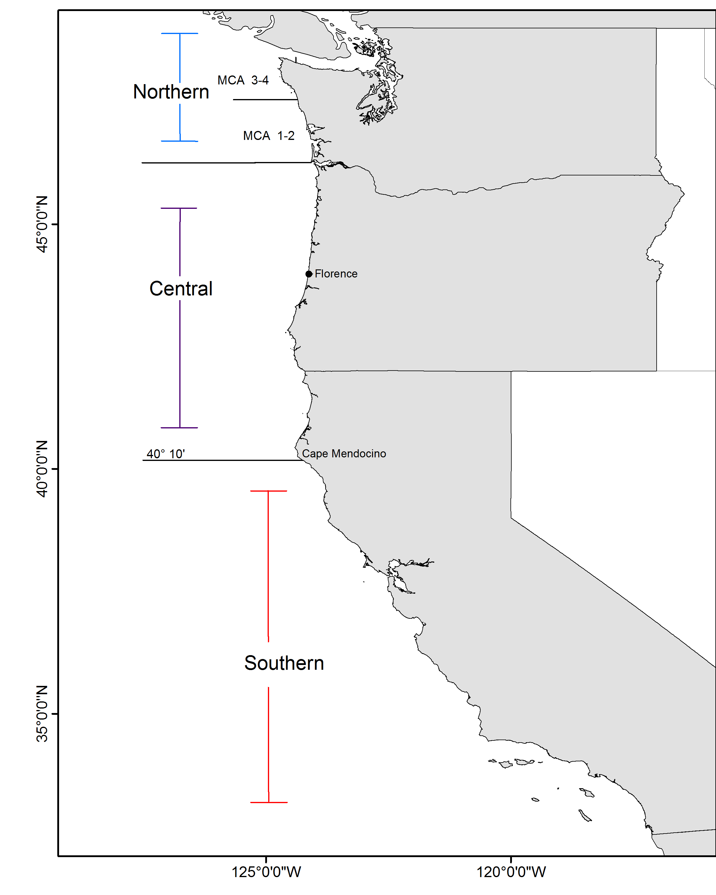

#Executive Summary{-}

##Stock{-}
This assessment reports the status of the `r spp` (\emph{`r spp.sci`}) species off rockfish off the U.S. West Coast from Northern California to the Canadian Border using data 
through `r LastYR`.  `r spp` are most abundant in the Gulf of Alaska and have observed off of Japan, in the Bering Sea, and south to Baja California, although they are sparse south of Oregon and rare in southern California. Although catches north of the US-Canada border were not included in this assessment, it is not certain the connectivity of these populations with contribution to the biomass possibly through adult migration and/or larval dispersion.  Composition data indicate that good recruitment years coincide in Oregon and Washington. To date, no significant genetic differences have been found in the range covered by this assessment.


##Landings{-}
The first year that harvest of `r spp` exceeded 1 mt off the US West Coast first occured in 1929.  Catches ramped up in the 1940s with large removals in Washington waters.  During the 1950s the removals primarly occured in Oregon waters with catches from Washington declining following the 1940s. The largest removals in 1966-1968 were largely a result of harvest by foreing vessels.  The fishery proceed with more moderate removals ranging between 1,200 to 2,600 metric  tons per year between 1969 to 1980. Removals generally decined from 1981 to 1994 to between 1,000 and 1,700 metric tons per year.  `r spp` was declared overfished in 1999 resulting in large reduction in harvest in recent years since the declaration.  Since 2000, catches of `r spp` have ranged between 269 - 60 mt, with catches in 2016 totaling 67 mt.

`r spp` are a desirable market species and discarding has historically been low.  However, management restrictions (e.g. trip limits) have resulted in increased discarding since the early 1990s.  During the 2000s discarding increased for `r spp` due to harvest restrictions imposed to allow rebuilding, with estimated discard rates from the bottom trawl fishery peaking in 2009 and 2010, prior to implementation of catch shares in 2011.  Since 2011, discarding of `r spp` has been estimated to be less than 4% given observer data.


<!-- Catch table:                 (Table \ref{tab:Exec_catch})

Catch figure(s) with fleets: (Figures \ref{fig:Exec_catch1}-\ref{fig:Exec_catch3})  -->  

<!-- ***********CATCH TABLE************************************************ -->
```{r, results='asis'}
    #CSV: './txt_files/Exec_catch_summary.csv'
    # Catch table section in R_exec_summary_fig_tables.R
    # Print the table
    print(Exec_catch.table, include.rownames = FALSE, caption.placement = 'top')
```
<!-- ***********END EXECUTIVE SUMMARY CATCH FIGURES AND TABLES************* -->


\FloatBarrier

<!-- ***********BEGIN EXECUTIVE SUMMARY CATCH FIGURES AND TABLES*********** -->
<!-- ***********CATCH FIGURES********************************************** -->
```{r, fig.cap= paste('Landings of' ,spp, 'for California, Oregon, Washington, the Foriegn fishery (1966-1976), At-Sea Hake fishery, and fishery independent surveys. \\label{fig:Exec_catch1}',sep=' ')}
    # CSV: './txt_files/Exec_catch_for_figs.csv'
    # Note: you cannot have carriage returns in the R options line
    # Plot washington catches           
    Plot_catch(Catch_df = Exec_region1_catch)

```

\FloatBarrier

##Data and Assessment{-}
This a new full assessment for `r spp` which was last assessed in 2011.  In this assessment, all aspects of the model including catches, data, and modelling assumptions were re-evaluated as much as possible. The assessment was conducted using the length- and age-structured modeling software Stock Synthesis (version 3.30.30.05).  The coastwide population was modeled assuming separate growth and mortality parameters for each sex (a two-sex model) from `r Dat_start_mod1` to `r LastYR`, and forecasted beyond `r LastYR`.

All of the sources of data for `r spp` have been re-evaluated for 2017, excluding the historical fishery catch-per-unit time series. Changes of varying degrees have occurred in the data from those used in previous assessments. These current data represent the best available scientific information. The landings history has been updated and extended back to 1918, harvest was negligible before that year. Survey data from the Alaska and Northwest Fisheries Science Centers have been used to construct series of indices using a spatial temporal delta GLMM model as well as length, age and conditional age-at length compositions consistent with the stratifications used for constructing the indices.

The definition of fishing fleets have been changed from those in the 2011 assessment.  Three fishing fleets were specified within the model: 1) a combined bottom trawl, mid-water trawl and fixed gear fleet where only a small fraction of `r spp` occuring by fixed gear, 2) the historical foreign fleet, and 3) the at-sea hake fishery.  The fleet grouping were based on discarding practices.  The trawl fishery estimated a retention curve based upon discarding data and known management restrictions.  However, very little if any discarding is assumed to have occured by the foreign fleet and the catch reported by the at-sea hake fishery accounts for both discarded and landed fish and hence, no additional mortality was estimated for each of these fleets.  

The assessment uses landings data and discard-fraction estimates; catch-per-unit-of-effort and survey indices; length or age composition data for each year and fishery or survey (with conditional age at length compositional data for the NWFSC shelf-slope survey); information on weight-at-age, maturity-at-age, and fecundity-at-age; priors on natural mortality and the steepness of the Beverton-Holt stock-recruitment relationship; and estimates of ageing error. Recruitment at "equilibrium biomass", length-based selectivity of the fishery and surveys, retention of the fishery, catchability of the surveys, growth, the time series of biomass, age and size structure, and current and projected future stock status are outputs of the model. Natural mortality and steepness were fixed in the final model. This was done due to relatively flat likelihood surfaces, such that fixing parameters and then varying them was deemed the best way to characterize uncertainty.

Although there are many types of data available for `r spp` since the 1980s, which were used in this assessment, there is little information about steepness and natural mortality. Estimates of steepness are uncertain partly because of variable recruitment. Uncertainty in natural mortality is common in many fish stock assessments even when length and age data are available. 

A number of sources of uncertainty are explicitly included in this assessment. For example, allowance is made for uncertainty in survey catchability coefficients. Furthermore, this assessment includes gender differences in growth, a non-linear relationship between individual spawner biomass and effective spawning output, and an updated relationship between length and maturity, based upon non-published information (M. Head, personal communication). As is always the case, overall uncertainty is greater than that predicted by a single model specification. Among other sources of uncertainty that are not included in the current model are the degree of connectivity between the stocks of `r spp` off of Vancouver Island, British Columbia and those in PFMC waters, and the effect of climatic variables on recruitment, growth and survival of `r spp`.

A reference case was selected which adequately captures the central tendency for those sources of uncertainty considered in the model.

<!--Map of assessment region: (Figure \ref{fig:assess_region_map}).  
 
  \FloatBarrier  -->


##Stock Biomass{-}
The predicted spawning biomass from the base model generally showed a slight decline over the time series until 1966 when the foreign fleet began. A short, but sharp decline occurred, followed by a period of the stock biomass stabilizing or with a minimimal decline until the late 1990s. The stock showed increases in stock size following the year 2000 when a combination of strong recruitment and low catches resulted. The `r LastYR` spawning biomass relative to unfished equilibrium spawning biomass is above the target of 40% of unfished spawning biomass at `r LastYR` is `r Depl_mod1` (~95% asymptotic interval: $\pm$ `r Depl_mod1_CI`)%. Approximate confidence intervals based on the asymptotic variance estimates show that the uncertainty in the estimated spawning biomass is high.

<!--BEGIN  EXECUTIVE SUMMARY SPAWNING BIOMASS AND DEPLETE TABLES AND FIGURES-->
```{r, results='asis'}
    # Select which file to use for the recuitment figure, depending on if you have one model or multiple models
    spawn.file  = ifelse(fecund=='numbers',
                           'r4ss/plots_mod1/ts7_Spawning_output_with_95_asymptotic_intervals_intervals.png',
                           'r4ss/plots_mod1/ts7_Spawning_biomass_(mt)_with_95_asymptotic_intervals_intervals.png')
    Bratio.file = 'r4ss/plots_mod1/ts9_Spawning_depletion_with_95_asymptotic_intervals_intervals.png' 

```


<!--BEGIN  EXECUTIVE SUMMARY SPAWNING BIOMASS AND DEPLETE TABLES AND FIGURES-->
```{r, results='asis'}
    # Print spawning biomass table(s)
    print(Spawn_Deplete_mod1.table, include.rownames = FALSE, caption.placement = 'top')

```

\FloatBarrier


##Recruitment{-}
Recruitment deviations were estimated for the entire time-series modeled. There is little information regarding recruitment prior to 1965, and the uncertainty in these estimates is expressed in the model. Historically, there are estimates of large recruitments in 1999 and 2000.  In recent years, a recruitment of unprecedented size is estimated to have occurred in 2008 but is highly uncertain.  Additionally, there is early evidence of a strong recruitment in 2013.  The four lowest recruitments (in ascending order) occurred in `r recdev.lowest[1]`, `r recdev.lowest[2]`, `r recdev.lowest[3]`, and `r recdev.lowest[4]`.  

<!-- ***********BEGIN EXECUTIVE SUMMARY RECRUITMENT TABLES AND FIGURES***** -->
```{r, results='asis'}
   recruit.file  = 'r4ss/plots_mod1/ts11_Age-0_recruits_(1000s)_with_95_asymptotic_intervals.png'
```


```{r, results='asis'}
   print(Recruit_mod1.table, include.rownames = FALSE, caption.placement = 'top')
   recruit.file  = 'r4ss/plots_mod1/ts11_Age-0_recruits_(1000s)_with_95_asymptotic_intervals.png'
  
```

\FloatBarrier


##Exploitation status{-}
The spawning biomass of `r spp` reached a low in `r low.ssb`.  Catches for `r spp` decreased significantly in 2000 compared to previous years. The estimated relative biomass was possibly below the overfished level in the early 2000s, but has likely remained above that level otherwise, and currently is significantly greater than the 40% unfished spawning biomass target. Throughout the late 1960s and 1970s the exploitation rate and $(1-SPR)/(1-SPR_{50\%})$ were mostly above target levels. Recent exploitation rates on `r spp` were predicted to be significantly below target levels.


<!-- ***********BEGIN EXECUTIVE SUMMARY EXPLOITATION AND******************* -->
<!-- ***********SPRratio TABLE AND FIGURES********************************* -->
```{r, results='asis'}
   # Print exploitation and SPRratio tables depending on how many models there are
     print(SPRratio_Exploit_mod1.table, include.rownames = FALSE, caption.placement = 'top')

   # select the files for the SPR and phase plots depending on the number of models
     SPR.file   = 'r4ss/plots_mod1/SPR3_ratiointerval.png'
     Phase.file = 'r4ss/plots_mod1/SPR4_phase.png' 
```

\FloatBarrier


##Ecosystem Considerations{-}

Rockfish are an important component of the California Current ecosystem along the US west coast, with its more than sixty five species filling various niches in both soft and hard bottom habitats from the nearshore to the continental slope, as well as near bottom and pelagic zones. `r spp` are generally considered to be semi-demersal but, there can at times, be a significant pelagic component to their distribution.

Recruitment is one mechanism by which the ecosystem may directly impact the population dynamics of `r spp`. The 1999 cohort for many species of rockfish was large - sometimes significantly so - from these species' long-term averages suggesting that environmental conditions may influence the spawning success and survival of larvae and juvenile rockfish. `r spp` showed an above average recruitment deviation in 1999 and 2000, but absolute recruitment was not as large as other years. The specific pathways through which environmental conditions exert influence on `r spp` dynamics are unclear; however, changes in water temperature and currents, distribution of prey and predators, and the amount and timing of upwelling are all possible linkages. Changes in the environment may also result in changes in age-at-maturity, fecundity, growth, and survival which can affect how the status of the stock and its susceptibility to fishing are determined. Unfortunately, there are few data available for `r spp` that provide insights into these effects.

Fishing has effects on both the age structure of a population as well as the habitat with which the target species is associated. Fishing often targets larger, older fish, and years of fishing mortality results in a truncated age-structure when compared to unfished conditions. Rockfish are often associated with habitats containing living structure such as sponges and corals, and fishing may alter that habitat to a less desirable state. This assessment provides a look at the effects of fishing on age structure, and recent studies on essential fish habitat are beginning to characterize important locations for rockfish throughout their life history; however there is little current information available to evaluate the specific effects of fishing on the ecosystem issues specific to `r spp`.


##Reference Points{-}

This stock assessment estimates that `r spp` in the `r mod1_label` are `r ifelse(Deplete_mod1[nrow(Deplete_mod1),2]-MT>0,"above","below")` the biomass target. Due to the large 2008 year-class, an increasing trend in spawning biomass was estimated in the base model. The estimated relative biomass level in `r LastYR` is `r Depl_mod1` (~95% asymptotic interval: $\pm$ `r Depl_mod1_CI`), corresponding to an unfished spawning output of `r paste(Spawn_mod1, fecund_unit,sep=' ')` (~95% asymptotic interval: `r paste(Spawn_mod1_CI, fecund_unit, sep=' ')`) of spawning output in the base model.  Unfished age `r min_age` biomass was estimated to be `r Ref_pts_mod1[2,2]` mt in the base case model. The target spawning output based on the biomass target ($SB_{40\%}$) is `r paste(Ref_pts_mod1[7,2], fecund_unit,sep=' ')`, which gives a catch of `r Ref_pts_mod1[10,2]` mt. Equilibrium yield at the proxy $F_{MSY}$ harvest rate corresponding to $SPR_{50\%}$ is `r Ref_pts_mod1[15,2]` mt.


<!-- ***********BEGIN EXECUTIVE SUMMARY REFERENCE POINT TABLES************* -->
```{r, results='asis'}
   # Print reference point tables
     print(Ref_pts_mod1.table, include.rownames = FALSE, caption.placement = 'top',
           sanitize.text.function = function(x){x})
```
<!-- ***********END EXECUTIVE SUMMARY REFERENCE POINT TABLES*************** --> 

\FloatBarrier


##Management Performance{-}
Exploitation rates on `r spp` exceeded MSY proxy target harvest rates during the 1960s and 1970s and spawning biomass is predicted to have fallen below the proxy management target of 40%. Exploitation rates subsequently declined to rates at or below the management target in the 1980s.  Managment restrictions imposed in the 1990s further reduced exploitation rates. An overfished declaration for `r spp` resulted in very low exploitation rates since 2001 with the ACLs being set far below the OFL and ABC values.


<!-- ***********BEGIN EXECUTIVE SUMMARY MANAGEMENT PERFORMANCE TABLE******* --> 
```{r, results='asis'}
    # Print management performance table - will have to edit the text file and 
    # R code for this table
    # Edit file: './txt_files/Exec_mngmt_performance.csv'
    print(mngmnt.table, include.rownames = FALSE, caption.placement = 'top', 
          sanitize.text.function = function(x){x}, scalebox = .9)
```
<!-- ***********END EXECUTIVE SUMMARY MANAGEMENT PERFORMANCE TABLE********* -->
\FloatBarrier


##Unresolved Problems And Major Uncertainties{-}
   TBD after STAR panel

\FloatBarrier


##Decision Table(s) (groundfish only){-}    
\hl{Include: projected yields (OFL, ABC and ACL), spawning biomass, and stock 
depletion levels for each year. Not required in draft assessments undergoing review.}
    
OFL projection table: Table \ref{tab:OFL_projection}    

Decision table(s) Table \ref{tab:Decision_table_mod1}, 
                  Table \ref{tab:Decision_table_mod2}, 
                  Table \ref{tab:Decision_table_mod3}
 
    Yield curve: Figure \ref{fig:Yield_all}

<!-- ***********BEGIN EXECUTIVE SUMMARY OFL AND DECISION TABLES************ -->
```{r, results='asis'}   
    # Print OFL table 
      print(OFL.table, include.rownames = FALSE, caption.placement = 'top')

   # Decision tables currently read in as txt files and will need to be changed
   # Decision table text set up for alternate states of natural mortality, but 
   # the text can be changed in the Decision Table section of the R file, 
   # R_exec_summary_figs_tables.R
   # Edit text file(s): ./txt_files/DecisionTable_mod1 ,  
   # ./txt_files/DecisionTable_mod1 , and
   # ./txt_files/DecisionTable_mod3
    # print Model 1 decision table
    print(decision_mod1.table, add.to.row = addtorow, include.rownames = FALSE, 
          caption.placement = 'top', 
          hline.after = c(-1, 0, 10, 20, 30, nrow(decision_mod1.table)), 
          scalebox = .85)
```
<!-- ***********END EXECUTIVE SUMMARY OFL AND DECISION TABLES************** -->


##Research And Data Needs{-}
\hl{Include: identify information gaps that seriously impede the stock assessment.}    

We recommend the following research be conducted before the next assessment:

\begin{enumerate}

\item List item No. 1 in the list

\item List item No. 2 in the list, etc.

\end{enumerate}


<!-- ***********BEGIN EXECUTIVE SUMMARY RESULTS SUMMARY TABLE --> 
```{r, results='asis'}
   # Print the results summary table, will have to edit the R code and input file 
   # depending on the stock structure
   # Edit file: ./txt_files/Exec_basemodel_summary.csv and the Summary Results 
   # section in R code R_exec_summary_figs_tables.R

 print(base_summary.table, 
       include.rownames = FALSE, 
       caption.placement = 'top',
       floating.environment = 'sidewaystable', 
       sanitize.text.function = function(x){x}, 
       scalebox = .6, 
       align = TRUE, 
       hline.after = c(-1, 0, 4, 5, 7, 9, 11, nrow(base_summary.table)))
```

<!-- ***********Yield curve table****************************************** -->
```{r, results='asis'}
   # Select the file to use for the yield curve depending on the number of models
     yield.file  = 'r4ss/plots_mod1/yield1_yield_curve.png'
    
```
<!-- ***********Edit caption based on fixed params************************* -->


\FloatBarrier

<!-- ***********END EXECUTIVE SUMMARY RESULTS SUMMARY TABLE AND YIELD CURVE -->


<!--************RESET FIGURE & TABLE NUMBERS FOR THE DOCUMENT'S MAIN BODY** -->
\newpage
\renewcommand{\thefigure}{\arabic{figure}}
\renewcommand{\thetable}{\arabic{table}}
\setcounter{figure}{0}
\setcounter{table}{0}
