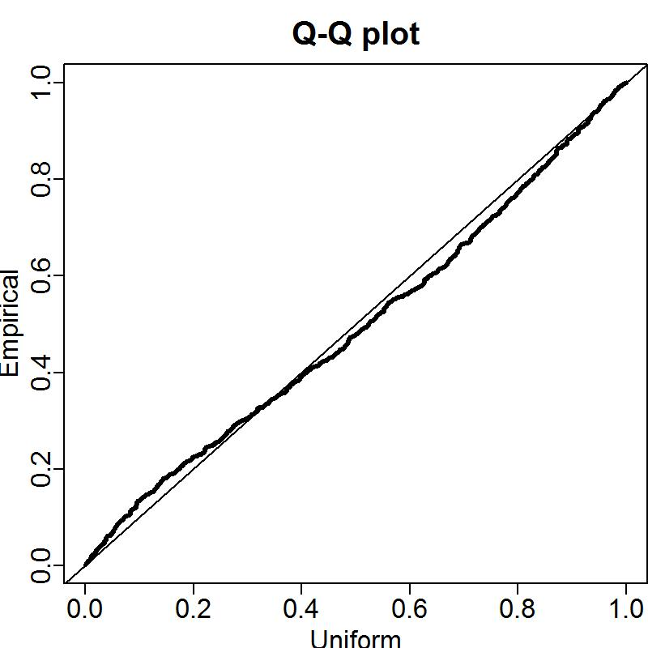
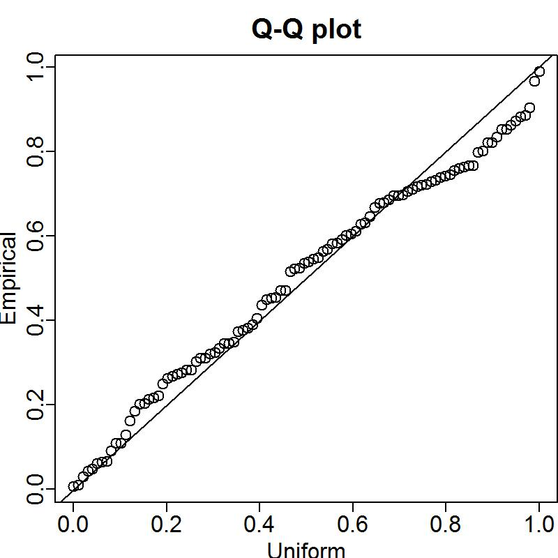

<!-- ====================================================================== -->
<!-- **************************             ******************************* --> 
<!-- **************************BEGIN FIGURES******************************* --> 
<!-- **************************             ******************************* -->
<!-- ====================================================================== -->

#Figures

\FloatBarrier

<!-- ====================================================================== --> 
<!-- *********************INTRODUCTION FIGURES***************************** --> 
<!-- ====================================================================== --> 
  
<!-- 
 
-->

<!-- ********************************************************************** --> 
<!-- ******************Commercial landings FIGURES************************* --> 
<!-- *************************  FIGURE 1  ********************************* -->
<!-- ********************************************************************** --> 
  

  
\FloatBarrier


<!-- ********************************************************************** --> 
<!-- *************************Data FIGURES********************************* --> 
<!-- *************************  FIGURE 2  ********************************* -->
<!-- ********************************************************************** -->
  


\FloatBarrier


<!-- ********************************************************************** 
<!-- ****************Length and Age Composition FIGURES******************** --> 
<!-- ********************************************************************** -->



\FloatBarrier


\FloatBarrier


\FloatBarrier




\FloatBarrier


\FloatBarrier


\FloatBarrier


\FloatBarrier


\FloatBarrier


\FloatBarrier


\FloatBarrier


\FloatBarrier


\FloatBarrier


\FloatBarrier


\FloatBarrier


<!-- ****************************************************************************** --> 
<!-- *****************Commercial Comps & Discards FIGURES************************** --> 
<!-- ****************************************************************************** -->


\FloatBarrier


\FloatBarrier


\FloatBarrier


\FloatBarrier


\FloatBarrier


<!-- ====================================================================== -->
<!-- *****************                             ************************ -->
<!-- *****************START BIOLOGICAL DATA FIGURES************************ --> 
<!-- *****************                            ************************ -->
<!-- ====================================================================== -->

<!-- ********************************************************************** -->
<!-- *****************Maturity and Fecundity FIGURES*********************** --> 
<!-- ********************************************************************** -->


  
\FloatBarrier 


<!-- ********************************************************************** -->
<!-- **********************Weight-Length FIGURES*************************** --> 
<!-- ********************************************************************** -->


\FloatBarrier 


\FloatBarrier 

<!-- ********************************************************************** -->
<!-- **********************Length-at-Age FIGURES*************************** --> 
<!-- ********************************************************************** -->


\FloatBarrier 

<!-- ********************************************************************** -->
<!-- ****************Aging Precision and Bias FIGURES********************** --> 
<!-- ********************************************************************** -->


\FloatBarrier 

<!-- ********************************************************************** -->
<!-- **********************Catch Comparison******************************** --> 
<!-- ********************************************************************** -->


\FloatBarrier 


<!-- ********************************************************************** -->
<!-- *********************Model Bridging Figure**************************** --> 
<!-- ********************************************************************** -->


\FloatBarrier 
  
<!-- ********************************************************************** -->
<!-- ****************Length Composition Fits and EffN********************** --> 
<!-- ********************************************************************** -->
  
```{r, results='asis'}
# Plot all of the timeseries plots
for(i in 1:(dim(LenComp_mod1)[1])) {
  
  # find matches to multi-page plots
  #page_test = sapply(multi_page_fig, grepl, LenComp_mod1$label[i])
  

  #if(!TRUE %in% page_test)
  #{
    cat('\n![', LenComp_mod1[i,caption_col], ' \\label{fig:mod1_', i, '_', LenComp_mod1[i, label_col], '}](', LenComp_mod1[i, path_col], ')\n', sep='')
  #} 
  
   # if the plot is page2+ of a series, add the extra caption
  #if(TRUE %in% page_test) {
  #  cat('\n', sep='')
    
  #  cat('\\begin{center} \n
  #     Figure continued from previous page \n
  #      \\end{center}',sep='')
    
  #}
}
```


\FloatBarrier

<!-- ********************************************************************** -->
<!-- **********************Age structure FIGURES*************************** --> 
<!-- ********************************************************************** -->
  
    
```{r, results='asis'}
# Plot all of the timeseries plots
for(i in 1:(dim(AgeComp_mod1)[1])) {
  
  # find matches to multi-page plots
  #page_test = sapply(multi_page_fig, grepl, LenComp_mod1$label[i])
  

  #if(!TRUE %in% page_test)
  #{
    cat('\n![', AgeComp_mod1[i,caption_col], ' \\label{fig:mod1_', i, '_',AgeComp_mod1[i, label_col], '}](', AgeComp_mod1[i, path_col], ')\n', sep='')
  #} 
  
   # if the plot is page2+ of a series, add the extra caption
  #if(TRUE %in% page_test) {
  #  cat('\n', sep='')
    
  #  cat('\\begin{center} \n
  #     Figure continued from previous page \n
  #      \\end{center}',sep='')
    
  #}
}
```

  
<!-- ********************************************************************** -->
<!-- *************Conditional Age structure FIGURES************************ --> 
<!-- ********************************************************************** -->
  
    
```{r, results='asis'}
# Plot all of the timeseries plots
for(i in 1:(dim(AALComp_mod1)[1])) {
  
  # find matches to multi-page plots
  #page_test = sapply(multi_page_fig, grepl, LenComp_mod1$label[i])
  

  #if(!TRUE %in% page_test)
  #{
    cat('\n![', AALComp_mod1[i,caption_col], ' \\label{fig:mod1_', i, '_',AALComp_mod1[i, label_col], '}](', AALComp_mod1[i, path_col], ')\n', sep='')
  #} 
  
   # if the plot is page2+ of a series, add the extra caption
  #if(TRUE %in% page_test) {
  #  cat('\n', sep='')
    
  #  cat('\\begin{center} \n
  #     Figure continued from previous page \n
  #      \\end{center}',sep='')
    
  #}
}
```

  
  
  
  
  

  
  
  
  
  
  
<!-- ====================================================================== -->
<!-- ******************                           ************************* -->
<!-- ******************END BIOLOGICAL DATA FIGURES************************* --> 
<!-- ******************                           ************************* -->
<!-- ====================================================================== -->
  
  
  
  
  
  
  
  
  
  
\FloatBarrier

<!-- ********************************************************************** -->
<!-- ***********History of modelleing approaches FIGURES******************* --> 
<!-- ********************************************************************** -->
  
  
  
  
  
<!-- ********************************************************************** -->
<!-- ****************STAR PANEL Recommendations FIGURES******************** --> 
<!-- ********************************************************************** -->
  
  
  
  
  
<!-- ********************************************************************** -->
<!-- ****************Model description section FIGURES********************* --> 
<!-- ********************************************************************** -->
  
  
  
  
\FloatBarrier

<!-- ====================================================================== -->
<!-- *********************BASE MODEL FIGURES******************************* -->
<!-- ====================================================================== -->
  
<!-- ***********MODEL 1 BASE MODEL FIGURES********************************* --> 
  
  
\FloatBarrier


  
  
  
  
<!-- ********************************************************************** -->
<!-- ****************Uncertainty and Sensitivity FIGURES******************* -->
<!-- ********************************************************************** -->
  
<!-- ***********MODEL 1 Uncertainty and Sensitivity FIGURES**************** --> 
  
  
  
  
  
  
  
<!-- ********************************************************************** -->
<!-- *****************Retrospective analysis FIGURES*********************** -->
<!-- ********************************************************************** -->

<!-- ***********MODEL 1 Retrospective analysis FIGURE********************** --> 


  
\FloatBarrier


  
\FloatBarrier


<!-- ********************************************************************** -->
<!-- ******************Likelihood profile FIGURES************************** --> 
<!-- ********************************************************************** -->
  
<!-- ***********R0 Likelihood profile FIGURES****************************** --> 
  
  
<!-- ***********M Likelihood profile FIGURES******************************* -->
  
  
  
<!-- ***********h Likelihood profile FIGURES******************************* -->
  
  
\FloatBarrier

<!-- ***********Post-STAR M Likelihood profile FIGURES********************* -->
  
  
  
  
  
  
  
<!-- ********************************************************************** -->
<!-- *********************REFERENCE POINTS FIGURES************************* --> 
<!-- ********************************************************************** -->
  
<!-- ***********MODEL 1 REFERENCE POINTS FIGURES*************************** --> 
  
  
  
\FloatBarrier

  
  
<!-- ********************************************************************** --> 
<!-- *************************FORECAST FIGURES***************************** --> 
<!-- ********************************************************************** --> 
  
\newpage

