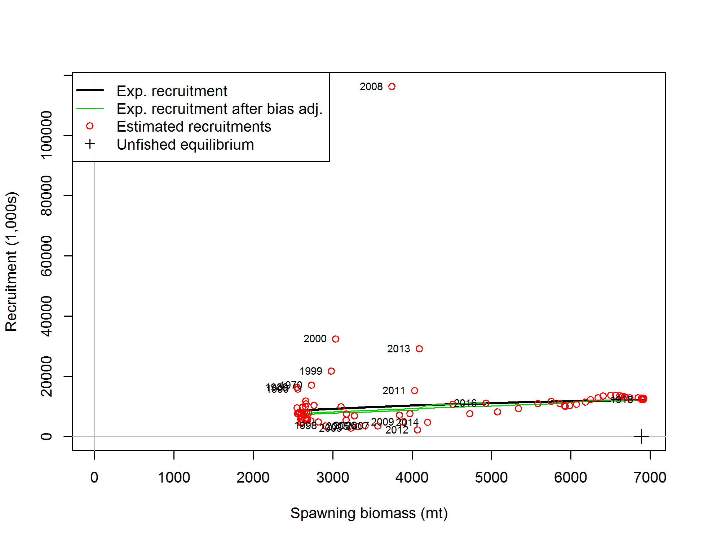
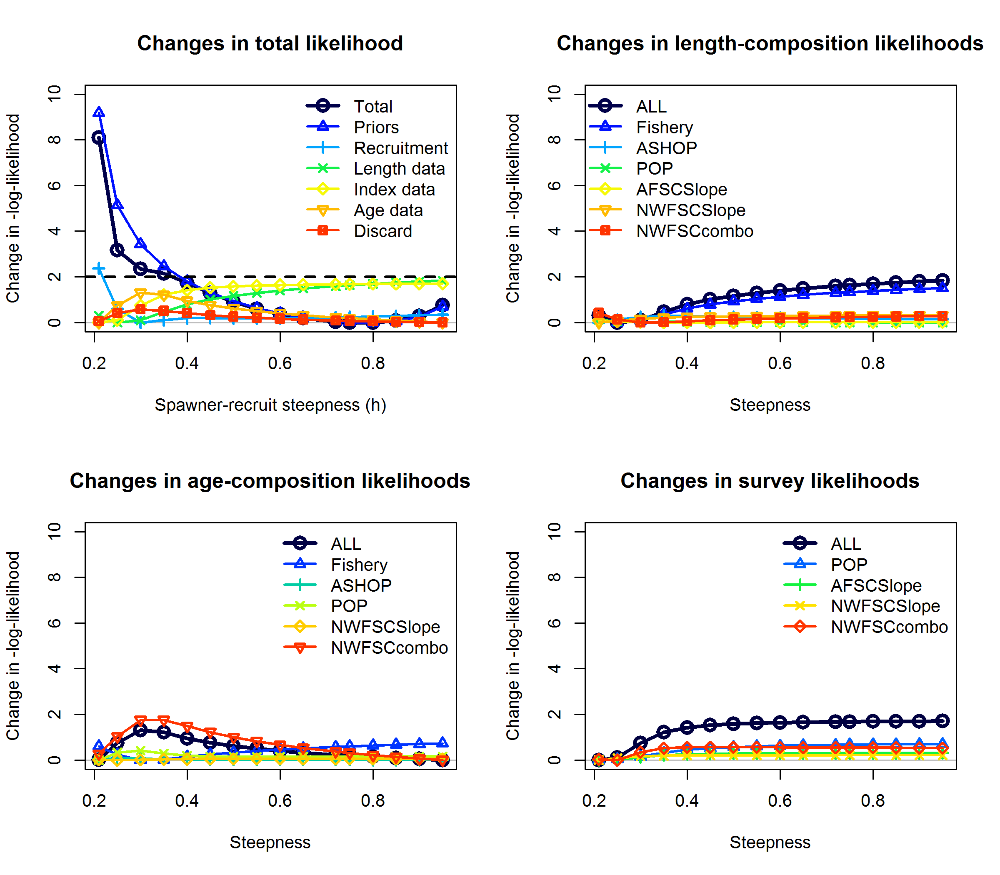
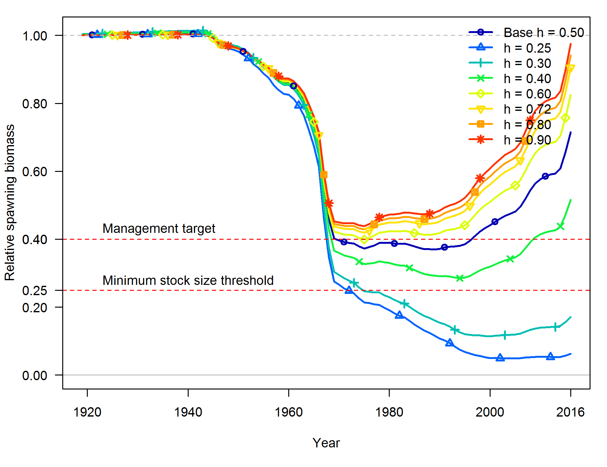
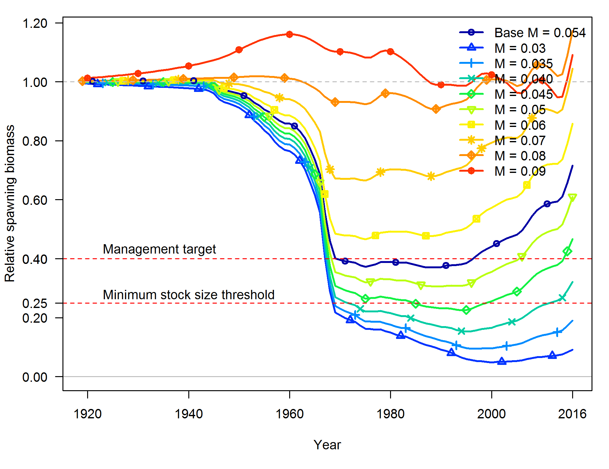
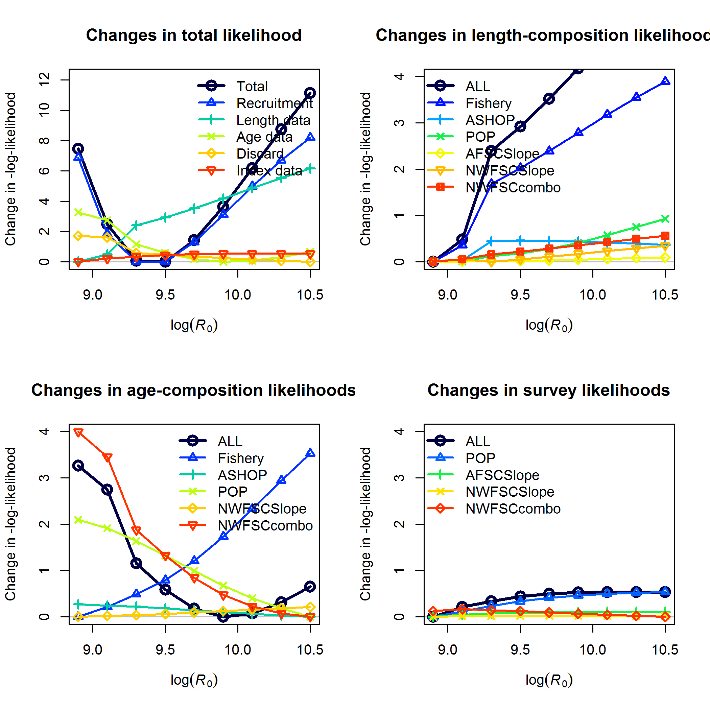

<!-- ====================================================================== -->
<!-- **************************             ******************************* --> 
<!-- **************************BEGIN FIGURES******************************* --> 
<!-- **************************             ******************************* -->
<!-- ====================================================================== -->

#Figures

\FloatBarrier

<!-- ====================================================================== --> 
<!-- *********************INTRODUCTION FIGURES***************************** --> 
<!-- ====================================================================== --> 
  
<!-- 
 
-->

<!-- ********************************************************************** --> 
<!-- ******************Commercial landings FIGURES************************* --> 
<!-- *************************  FIGURE 1  ********************************* -->
<!-- ********************************************************************** --> 
  

  
\FloatBarrier


<!-- ********************************************************************** --> 
<!-- *************************Data FIGURES********************************* --> 
<!-- *************************  FIGURE 2  ********************************* -->
<!-- ********************************************************************** -->
  


\FloatBarrier


<!-- ********************************************************************** 
<!-- ****************Length and Age Composition FIGURES******************** --> 
<!-- ********************************************************************** -->


\FloatBarrier


\FloatBarrier


\FloatBarrier


\FloatBarrier


\FloatBarrier


\FloatBarrier


\FloatBarrier


\FloatBarrier


\FloatBarrier


\FloatBarrier


\FloatBarrier


\FloatBarrier


\FloatBarrier


\FloatBarrier


\FloatBarrier


<!-- ****************************************************************************** --> 
<!-- *****************Commercial Comps & Discards FIGURES************************** --> 
<!-- ****************************************************************************** -->


\FloatBarrier


\FloatBarrier


\FloatBarrier


\FloatBarrier


\FloatBarrier


<!-- ====================================================================== -->
<!-- *****************                             ************************ -->
<!-- *****************START BIOLOGICAL DATA FIGURES************************ --> 
<!-- *****************                            ************************ -->
<!-- ====================================================================== -->

<!-- ********************************************************************** -->
<!-- *****************Maturity and Fecundity FIGURES*********************** --> 
<!-- ********************************************************************** -->


  
\FloatBarrier 


<!-- ********************************************************************** -->
<!-- **********************Weight-Length FIGURES*************************** --> 
<!-- ********************************************************************** -->


\FloatBarrier 


\FloatBarrier 

<!-- ********************************************************************** -->
<!-- **********************Length-at-Age FIGURES*************************** --> 
<!-- ********************************************************************** -->


\FloatBarrier 

<!-- ********************************************************************** -->
<!-- ****************Aging Precision and Bias FIGURES********************** --> 
<!-- ********************************************************************** -->


\FloatBarrier 

<!-- ====================================================================== -->
<!-- ******************                           ************************* -->
<!-- ******************END BIOLOGICAL DATA FIGURES************************* --> 
<!-- ******************                           ************************* -->
<!-- ====================================================================== -->


<!-- ********************************************************************** -->
<!-- **********************Catch Comparison******************************** --> 
<!-- ********************************************************************** -->


\FloatBarrier 


<!-- ********************************************************************** -->
<!-- *********************Model Bridging Figure**************************** --> 
<!-- ********************************************************************** -->


\FloatBarrier 

<!-- ====================================================================== -->
<!-- *********************BASE MODEL FIGURES******************************* -->
<!-- ====================================================================== -->
  
<!-- ***********MODEL 1 BASE MODEL FIGURES********************************* --> 


<!-- ********************************************************************** -->
<!-- *******************Estimated Length-at-Age**************************** --> 
<!-- ********************************************************************** -->


\FloatBarrier 

<!-- ********************************************************************** -->
<!-- *******************Selectivity & Retention**************************** --> 
<!-- ********************************************************************** -->


\FloatBarrier 


\FloatBarrier 

<!-- ********************************************************************** -->
<!-- ******************** Estimated Recruitment**************************** --> 
<!-- ********************************************************************** -->


_with_95_asymptotic_intervals.png)
  
\FloatBarrier


  
\FloatBarrier


<!-- ********************************************************************** -->
<!-- ***********************Fits to the Indices**************************** --> 
<!-- ********************************************************************** -->


\FloatBarrier 


<!-- ********************************************************************** -->
<!-- *******************Fits to the Discard Data*************************** --> 
<!-- ********************************************************************** -->


\FloatBarrier 

.png)

  
<!-- ********************************************************************** -->
<!-- ****************Length Composition Fits and EffN********************** --> 
<!-- ********************************************************************** -->


```{r, results='asis'}

#Discard
cat('\n![', LenComp_mod1[2,caption_col], ' \\label{fig:discard_len_pearson}](', LenComp_mod1[2, path_col], ')\n', sep='')

#Fishery
cat('\n![', LenComp_mod1[9,caption_col], ' \\label{fig:fishery_len_pearson}](', LenComp_mod1[9, path_col], ')\n', sep='')

#ASHOP
cat('\n![', LenComp_mod1[13,caption_col], ' \\label{fig:ashop_len_pearson}](', LenComp_mod1[13, path_col], ')\n', sep='')

#POP
cat('\n![', LenComp_mod1[17,caption_col], ' \\label{fig:pop_len_pearson}](', LenComp_mod1[17, path_col], ')\n', sep='')

#Triennial
cat('\n![', LenComp_mod1[21,caption_col], ' \\label{fig:tri_len_pearson}](', LenComp_mod1[21, path_col], ')\n', sep='')

#AFSC
cat('\n![', LenComp_mod1[25,caption_col], ' \\label{fig:afsc_len_pearson}](', LenComp_mod1[25, path_col], ')\n', sep='')

#NWFSC
cat('\n![', LenComp_mod1[29,caption_col], ' \\label{fig:nwfsc_len_pearson}](', LenComp_mod1[29, path_col], ')\n', sep='')

#NWFSC Combo
cat('\n![', LenComp_mod1[33,caption_col], ' \\label{fig:nwfsc_combo_len_pearson}](', LenComp_mod1[33, path_col], ')\n', sep='')

```


<!-- *************** MEAN LENGTH FITS ********************************-->

```{r, results='asis'}

#Fishery
cat('\n![', LenComp_mod1[11,caption_col], ' \\label{fig:weighting_len_fishery}](', LenComp_mod1[11, path_col], ')\n', sep='')

#ASHOP
cat('\n![', LenComp_mod1[15,caption_col], ' \\label{fig:weighting_len_ashop}](', LenComp_mod1[15, path_col], ')\n', sep='')

#POP
cat('\n![', LenComp_mod1[19,caption_col], ' \\label{fig:weighting_len_pop}](', LenComp_mod1[19, path_col], ')\n', sep='')

#Triennial
cat('\n![', LenComp_mod1[23,caption_col], ' \\label{fig:weighting_len_triennial}](', LenComp_mod1[23, path_col], ')\n', sep='')

#AFSC
cat('\n![', LenComp_mod1[27,caption_col], ' \\label{fig:weighting_len_afsc}](', LenComp_mod1[27, path_col], ')\n', sep='')

#NWFSC
cat('\n![', LenComp_mod1[31,caption_col], ' \\label{fig:weighting_len_nwfsc}](', LenComp_mod1[31, path_col], ')\n', sep='')

#NWFSC Combo
cat('\n![', LenComp_mod1[35,caption_col], ' \\label{fig:weighting_len_nwfsccombo}](', LenComp_mod1[35, path_col], ')\n', sep='')

```


\FloatBarrier

<!-- ********************************************************************** -->
<!-- **********************Age structure FIGURES*************************** --> 
<!-- ********************************************************************** -->


```{r, results='asis'}


#Fishery
cat('\n![', AgeComp_mod1[3,caption_col], ' \\label{fig:fishery_age_pearson}](', AgeComp_mod1[3, path_col], ')\n', sep='')

#ASHOP
cat('\n![', AgeComp_mod1[7,caption_col], ' \\label{fig:ashop_age_pearson}](', AgeComp_mod1[7, path_col], ')\n', sep='')

#POP
cat('\n![', AgeComp_mod1[11,caption_col], ' \\label{fig:pop_age_pearson}](', AgeComp_mod1[11, path_col], ')\n', sep='')

#Triennial
cat('\n![', AgeComp_mod1[15,caption_col], ' \\label{fig:tri_age_pearson}](', AgeComp_mod1[15, path_col], ')\n', sep='')

#NWFSC
cat('\n![', AgeComp_mod1[19,caption_col], ' \\label{fig:nwfsc_age_pearson}](', AgeComp_mod1[19, path_col], ')\n', sep='')

plot.vec = 4:8
for(a in 1:length(plot.vec)){
#NWFSC Combo - Andre plots
cat('\n![', AALComp_mod1[plot.vec[a],caption_col], ' \\label{fig:nwfsc_combo_andre_',a,'}](', AALComp_mod1[plot.vec[a], path_col], ')\n', sep='')
}

#NWFSC Combo
#cat('\n![', AALComp_mod1[1,caption_col], ' \\label{fig:nwsfc_combo_age_aal1}](', AALComp_mod1[1, path_col], ')\n', sep='')

#NWFSC Combo
#cat('\n![', AALComp_mod1[2,caption_col], ' \\label{fig:nwsfc_combo_age_aal2}](', AALComp_mod1[2, path_col], ')\n', sep='')


```


<!-- *************** MEAN AGE FITS ********************************-->

```{r, results='asis'}

#Fishery
cat('\n![', AgeComp_mod1[5,caption_col], ' \\label{fig:weighting_fishery}](', AgeComp_mod1[5, path_col], ')\n', sep='')

#ASHOP
cat('\n![', AgeComp_mod1[9,caption_col], ' \\label{fig:weighting_ashop}](', AgeComp_mod1[9, path_col], ')\n', sep='')


#Triennial
cat('\n![', AgeComp_mod1[17,caption_col], ' \\label{fig:weighting_triennial}](', AgeComp_mod1[17, path_col], ')\n', sep='')


#NWFSC
cat('\n![', AgeComp_mod1[21,caption_col], ' \\label{fig:weighting_nwfscslope}](', AgeComp_mod1[21, path_col], ')\n', sep='')

#NWFSC Combo
cat('\n![', AALComp_mod1[3,caption_col], ' \\label{fig:weighting_nwfsccombo}](', AALComp_mod1[3, path_col], ')\n', sep='')

```

  
\FloatBarrier

<!-- ====================================================================== -->
<!-- ********************Time-Series Figures******************************* -->
<!-- ====================================================================== -->
  

  
\FloatBarrier

.png)

\FloatBarrier


  
\FloatBarrier


  
  

<!-- ********************************************************************** -->
<!-- ****************Uncertainty and Sensitivity FIGURES******************* -->
<!-- ********************************************************************** -->
  
<!-- ***********MODEL 1 Uncertainty and Sensitivity FIGURES**************** --> 
  


\FloatBarrier


\FloatBarrier


\FloatBarrier


\FloatBarrier
  
  
  
  
  
<!-- ********************************************************************** -->
<!-- *****************Retrospective analysis FIGURES*********************** -->
<!-- ********************************************************************** -->

<!-- ***********MODEL 1 Retrospective analysis FIGURE********************** --> 


  
\FloatBarrier


  
\FloatBarrier


<!-- ********************************************************************** -->
<!-- ******************Likelihood profile FIGURES************************** --> 
<!-- ********************************************************************** -->
  

  
\FloatBarrier


  
\FloatBarrier
  
  
<!-- ***********M Likelihood profile FIGURES******************************* -->

  
\FloatBarrier


  
\FloatBarrier
  
  
<!-- ***********R0 Likelihood profile FIGURES******************************* -->
  

  
\FloatBarrier

  
  
<!-- ********************************************************************** -->
<!-- *********************REFERENCE POINTS FIGURES************************* --> 
<!-- ********************************************************************** -->
  
<!-- ***********MODEL 1 REFERENCE POINTS FIGURES*************************** --> 


  
  
\FloatBarrier

![Equilibrium yield curve for the base case model. Values are based on the `r Dat_end_mod1` fishery selectivity and with steepness fixed at `r print(mod1$parameters[mod1$parameters$Label == "SR_BH_steep","Value"],2)`. \label{fig:yield}](r4ss/plots_mod1/yield1_yield_curve.png)

\FloatBarrier
  
  
<!-- ********************************************************************** --> 
<!-- *************************FORECAST FIGURES***************************** --> 
<!-- ********************************************************************** --> 
  
\newpage

