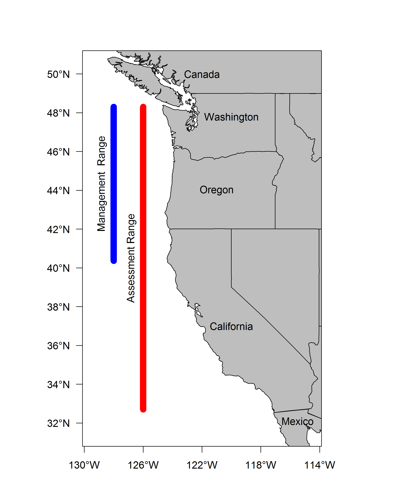

```{r setup, include=FALSE}
  knitr::opts_chunk$set(echo = FALSE, warning = FALSE, message = FALSE)
```

## Request 1

*Request:* Paste request here


*Response*

## Slide with Bullets

- Bullet 1
- Bullet 2
- Bullet 3

## Slide with R Output

```{r cars, echo = TRUE}
summary(cars)
```

## Slide using xtable
```{r, echo = FALSE}
library(pander)
library(xtable)
# Read in/organize sensitivity file, change column names, caption
Sens_model1 = read.csv('C:/Users/Chantel.Wetzel/Documents/GitHub/POP_2017/STAR/tables/Sensitivity1.csv')

colnames(Sens_model1) = c('Label', 
                          'Base',
                          'Split Triennial',
                          'Remove CPUE', 
                          'Canadian Data', 
                          'WA Research Lengths', 
                          'OR Special Projects')

panderOptions('table.split.table', 100)
pandoc.table(Sens_model1, split.table = Inf)

# Create sensitivities table
#Sens_model1.table = xtable(Sens_model1, 
#                           caption = c('Sensitivity of the base model'),
#                           label = 'tab:Sensitivity1',
#                           digits = 2)


#align(Sens_model1.table) = c('l', 'l', rep('>{\\centering}p{.8in}', dim(Sens_model1)[2]-1))


# Print model 1 sensitivity table
#print(Sens_model1.table, 
      #include.rownames = FALSE,             
      #caption.placement = 'top',
      #floating.environment = 'sidewaystable',
#      scalebox = .9)

```


## Slide with Plot

 

## Slide with R created plot

```{r pressure}
plot(pressure)
```

