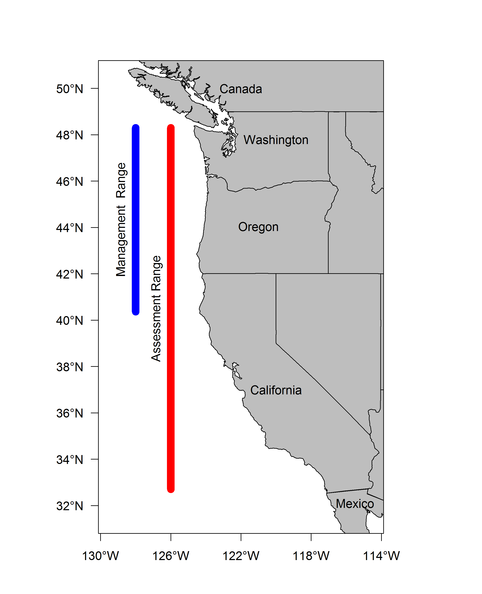

```{r setup, include=FALSE}
  knitr::opts_chunk$set(echo = FALSE, warning = FALSE, message = FALSE)
```

## R Markdown

This is an R Markdown document. Markdown is a simple formatting syntax for authoring HTML, PDF, and MS Word documents. For more details on using R Markdown see <http://rmarkdown.rstudio.com>.

When you click the **Knit** button a document will be generated that includes both content as well as the output of any embedded R code chunks within the document. You can embed an R code chunk like this:

```{r cars}
summary(cars)
```


## Slide using xtable
```{r, results = 'asis'}
library(pander)
library(xtable)
# Read in/organize sensitivity file, change column names, caption
Sens_model1 = read.csv('C:/Users/Chantel.Wetzel/Documents/GitHub/POP_2017/STAR/tables/Sensitivity1.csv')

colnames(Sens_model1) = c('Label', 
                          'Base',
                          'Split Triennial',
                          'Remove CPUE', 
                          'Canadian Data', 
                          'WA Research Lengths', 
                          'OR Special Projects')

#panderOptions('table.split.table', 100)
#pandoc.table(Sens_model1, split.table = Inf)

# Create sensitivities table
Sens_model1.table = xtable(Sens_model1, 
                           caption = c('Sensitivity of the base model'),
                           label = 'tab:Sensitivity1',
                           digits = 2)


align(Sens_model1.table) = c('l', 'l', rep('>{\\centering}p{.7in}', dim(Sens_model1)[2]-1))


# Print model 1 sensitivity table
print(Sens_model1.table, 
      include.rownames = FALSE,             
      caption.placement = 'top',
      floating.environment = 'sidewaystable',
      scalebox = .9)

```

\FloatBarrier

## Slide with Plot

 

## Slide with R created plot

```{r pressure}
plot(pressure)
```

